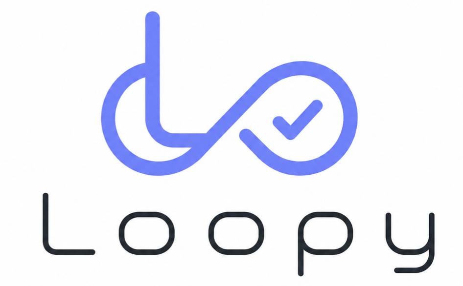

  

Hi, my name is Lee and I'm 12. I made Loopy so developers can easily automate their code without spending half an hour following a tutorial. So I made Loopy.

ABOUT ME

My full name is Lee Madover Speiser.
My dream is meeting Jensen Huang in person.
another dream of mine is making a massive AI model
Around 100 billion parameters that can run on a simple budget phone.

INSTALLATION

to install Loopy just tell Claude "install this skill https://github.com/leemadov/Loopy---Leemadov/blob/main/SKILL.md" now before you send a prompt put /loopy at the start for example: /loopy make an interactive website that explains Nvidia's blackwell architecture
